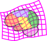

## If you are looking for **Eddeep**, go to this [[repo]](https://github.com/CIG-UCL/eddeep).

#  Polaffini  

This repository contains code for **Polaffini** [1], a feature-based approach for robust, anatomically grounded image registration.

**Polaffini** uses fine-grained segmentations to estimate a transformation that is anatomically grounded,

**Polaffini** is versatile, one can estimate rigid, affine, polyrigid or polyaffine transformations.\
Polyaffine/polyrigid transformations [2] have much more dofs compared to their global counterparts. Yet they are diffeomorphic through the SVF framework embedding, and fast to compute since the local matchings have closed-form solutions.

**Polaffini** is an efficient initialization to improve non-linear registration compared to the usual intensity-based affine pre-alignment (e.g. with FSL FLIRT).

<p align="center">

</p>

The code is in Python, using SimpleITK for most of the image IO and processing. It runs on CPU and leverages multi-threading.

# Installation

Installation can be done classically by cloning the repo and installing the dependancies in `requirement.txt`:
```bash
git clone git@github.com:CIG-UCL/polaffini.git
cd polaffini
pip install -r requirements.txt
```

Alternatively, one can use a pip command:
```bash 
pip install git+https://github.com/CIG-UCL/polaffini.git
```

# Segmentation
**Polaffini** performs registration based on segmentations. Images therefore need to be segmented first.

Fine-grained segmentations can be obtained using traditional tools like:
 - FreeSurfer [[website]](https://surfer.nmr.mgh.harvard.edu/), using `recon-all`.
   
or very quickly using pre-trained deep-learning models like:

 - FastSurfer [[github]](https://github.com/Deep-MI/FastSurfer)[[paper]](https://doi.org/10.1016/j.neuroimage.2020.117012)
 - SynthSeg [[paper]](https://arxiv.org/abs/2107.09559) which is contrast agnostic.\
   From Freesurfer:
   ```bash
   mri_synthseg --i <path-to-input-image> --o <path-to-output-segmentation> --parc
   ```
 - or any other segmentation tool...


# Using **Polaffini**

## 1. Small **Polaffini** tutorial
A good way to understand how it works is to go through the following small tutorial: `scripts/polaffini_example.py`.\
This script uses the data in `exmaple_data/`. Extract and tweak bits to fit your needs.

## 2. **Polaffini** between 2 subjects (or subject to template)

The script `polaffini_pair` should cover most usage. It performs **Polaffini** registration between two subjects.\
It uses the moving and target segmentations to estimate the transformation, then applies the transformation to the moving image.\
A parameter sigma modulates the smoothness.

   - By default, **Polaffini** estimates a polyaffine transformation with a smoothness parameter following Silverman's rule of thumb.
     ```bash
     python <path-to-polaffini>/scripts/polaffini_pair.py -m <path-to-moving-image>\
                                                          -ms <path-to-moving-segmentation>\
                                                          -rs <path-to-target-segmentation>\
                                                          -oi <path-to-output-moved-image>
     ```
     
   - One might want to ignore some labels that are not relevant for the estimation\
     (e.g. in the DKT segmentation: 2 and 41 are left and right cerebrum white matter which are too big, or 24 the outer CSF):
     ```bash
     python <path-to-polaffini>/scripts/polaffini_pair.py -m <path-to-moving-image>\
                                                          -ms <path-to-moving-segmentation>\
                                                          -rs <path-to-target-segmentation>\
                                                          -oi <path-to-output-moved-image>\
                                                          -omit_labs 2 41 24
     ```
     
   - For a chosen smoothness (e.g. 15 mm works well for DKT segmentation):
     ```bash
     python <path-to-polaffini>/scripts/polaffini_pair.py -m <path-to-moving-image>\
                                                          -ms <path-to-moving-segmentation>\
                                                          -rs <path-to-target-segmentation>\
                                                          -oi <path-to-output-moved-image>\
                                                          -omit_labs 2 41 24\
                                                          -sigma 15
     ```

   - To estimate an affine transformation, set the smoothness to infinity: 
     ```bash
     python <path-to-polaffini>/scripts/polaffini_pair.py -m <path-to-moving-image>\
                                                          -ms <path-to-moving-segmentation>\
                                                          -rs <path-to-target-segmentation>\
                                                          -oi <path-to-output-moved-image>\
                                                          -sigma inf
     ```

   - To estimate estimate rigid or polyrigid transformations, change the local transfos type to rigid:
     ```bash
     python <path-to-polaffini>/scripts/polaffini_pair.py -m <path-to-moving-image>\
                                                          -ms <path-to-moving-segmentation>\
                                                          -rs <path-to-target-segmentation>\
                                                          -oi <path-to-output-moved-image>\
                                                          -transfo 'rigid'
     ```

### All parameters:
   - Inputs:\
     `-ms` (required) Path to the moving segmentation.\
     `-rs` (required) Path to the reference segmentation, can be 'mni1' or 'mni2'.\
     `-m`, (default: None) Path to the moving image.\
     `-ma` (default: None) Path to the moving auxiliary image.\
     `-g` (default: None) Path to geometry image for resampling.\
     `-r` (default: None) Path to the reference image (for kissing).\
     `-ra` (default: None) Path to the reference auxiliary image (for kissing).
   - Outputs\
     `-oi` (default: None) Path to output image.\
     `-os` (default: None) Path to output moved segmentation.\
     `-oa` (default: None) Path to output moved auxiliary image\
     `-ot` (default: None) Path to output full transformations in diffeo form.\
     `-ota` (default: None) Path to output affine part of transformation (.txt).\
     `-otp` (default: None) Path to output polyaffine part of the transformation in SVF form.\
     `-k` (default: 0) Kissing mapping: meets at location alpha on the diffeomorphic path.
   - Polaffini parameters\
     `-transfo` (default: 'affine') Type of the local tranformations ('affine' or 'rigid').\
     `-sigma` (default: 'silverman') Standard deviation (in mm) for the Gaussian kernel. The higher the sigma, the smoother the output transformation. Use inf for affine transformation.\
     `-alpha` (default: 1) Position of the overall transformation on the diffeomorphic path from identity to the transfo from moving to reference (e.g. use 0.5 for half-way registration).\
     `-wbg` (default: 1e-5) Weight of the global background transformation for stability.\
     `-downf` (default: 4) Downsampling factor of the transformation.\
     `-dist` (default: 'center') Distance used for the weight maps. 'center': distance to neighborhood center, or 'maurer': distance to label.\
     `-omit_labs` (default: []) List of labels to omit. 0 (background) is always omitted.\
     `-bg_transfo` (default: 1) Compute an affine background transformation (1:yes, 0:no).
   - Other\
     `-do_bch` (default: 0) Use the BCH formula to compute the overall field (1:yes, 0:no).
    


## 2. Applying a transformation from **Polaffini** to any image

   - To output the full transfo and apply it to an image:
     ```bash
     python <path-to-polaffini>/scripts/polaffini_pair.py -m <path-to-moving-image>\
                                                          -ms <path-to-moving-segmentation>\
                                                          -rs <path-to-target-segmentation>\
                                                          -ot ${transfo}
     
     python <path-to-polaffini>/scripts/apply_transfos.py -m <path-to-moving-image>\
                                                          -g <path-to-target-image>\
                                                          -t <path-to-full-transfo>\
                                                          -oi <path-to-moved-image>
     ```

   - To do the same but disantagling the background affine and the polyaffine part\
     (the affine is a matrix, the polyaffine is saved in SVF (log) form):
     ```bash
     python <path-to-polaffini>/scripts/polaffini_pair.py -m <path-to-moving-image>\
                                                          -ms <path-to-moving-segmentation>\
                                                          -rs <path-to-target-segmentation>\
                                                          -ota <path-to-affine-transfo>\
                                                          -otp <path-to-polyaffine-transfo>
     
     python <path-to-polaffini>/scripts/apply_transfos.py -m <path-to-moving-image>\
                                                          -g <path-to-target-image>\
                                                          -t <path-to-affine-transfo> <path-to-polyaffine-transfo>\
                                                          -log 0 1\
                                                          -oi <path-to-moved-image>
     ```


## 3. POLAFFINI of a dataset onto a template

The script `/scripts/polaffini_set2template.py` allows to perform POLAFFINI on a set of subjects as well as various data preparation such as intensity normalization, one-hot encoding of segmentations... It can be typically used to prepare the data to be fed to a deep-learning model during its training.\


# References
If you use **Polaffini** for your work, please cite [1] (and potentially also [2]).
  - [1] A. Legouhy, R. Callaghan, H. Azadbakht and H. Zhang. POLAFFINI: Efficient feature-based polyaffine initialization for improved non-linear image registration. IPMI (2023) [[link]](https://arxiv.org/abs/2407.03922).
  - [2] V. Arsigny, O. Commowick, N. Ayache and X. Pennec. A Fast and Log-Euclidean Polyaffine Framework for Locally Linear Registration. J Math Imaging Vis 33, 222–238 (2009)
