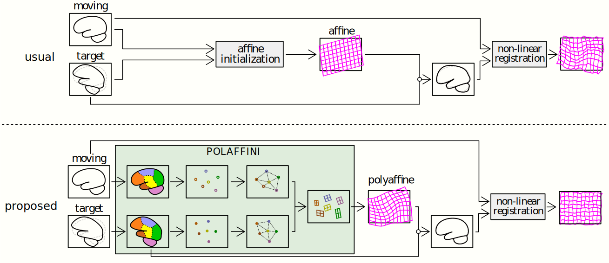

# dwarp & POLAFFINI

This repository contains code for:
 - **POLAFFINI** [1]: a segmentation-based polyaffine initialization for improved non-linear image registration. 
 - **dwarp**: tools for deep learning non-linear image registration to a template, and more...
   - Subject to single template
   - Subject to subject (pairwise)
   - **Eddeep** [3]: eddy-currents distortion correction [ :warning: SOON AVAILABLE (before MICCAI 2024 starts)]

Most of the code is in Python, deep-learning stuffs are based on Tensorflow library, image IO and processing is done using SimpleITK (conversion through nibabel for mgh/mgz files), deep-learning registration uses Voxelmorph [2] core.

# Installation

Installation can be done classically through git clone and installing the dependancies in `requirement.txt`. If you only need POLAFFFINI and do not install deep-learning stuff, you can use it as an independant module and use the requirement file in `polaffini/requirements`.

Alternatively, one can use a pip command to do everything in one go:
 - For **POLAFFINI** only: `pip install git+https://github.com/CIG-UCL/polaffini.git`
 - For **dwarp** also: `pip install "polaffini[dwarp] @ git+https://github.com/CIG-UCL/polaffini.git"`
   

# A. POLAFFINI
<p align="center">

</p>

POLAFFINI is an efficient initialization to improve non-linear registration compared to the usual intensity-based affine pre-alignment (e.g. with FSL FLIRT).\
POLAFFINI uses fine-grain segmentations to estimate a polyaffine transformation which anatomically grounded, fast to compute, and has more dofs than its affine counterpart.

Fine-grained segmentations can be obtained using traditional tools like:
 - `recon-all` from FreeSurfer suite [[website]](https://surfer.nmr.mgh.harvard.edu/)
   
or very quickly using pre-trained deep-learning models like:

 - FastSurfer [[github]](https://github.com/Deep-MI/FastSurfer)[[paper]](https://doi.org/10.1016/j.neuroimage.2020.117012)
 - SynthSeg [`mri_synthseg` in Freesurfer][[paper]](https://doi.org/10.1016/j.media.2023.102789) which is contrast agnostic.

 
## A.1. Small POLAFFINI tutorial
A good way to understand how it works is to go through the following small tutorial: `dwarp_public/scripts/polaffini_example.py`.\
This script uses the data available `dwarp_public/exmaple_data`. Extract and tweak bits to fit your needs.

## A.2. POLAFFINI between 2 subjects

The following script covers most usage, it performs POLAFFINI registration between two subjects.\
It uses the moving and target segmentations to estimate the polyaffine transformation, then applies the transformation to the moving image.
```bash
python <path-to-dwarp_public>/scripts/polaffini_pair.py -m <path-to-moving-image>\
                                                        -ms <path-to-moving-segmentation>\
                                                        -rs <path-to-target-segmentation>\
                                                        -oi <path-to-output-moved-image>
```

## A.3. POLAFFINI of a dataset onto a template

The script `/scripts/polaffini_set2template.py` allows to perform POLAFFINI on a set of subjects as well as various data preparation such as intensity normalization, one-hot encoding of segmentations... It can be typically used to prepare the data to be fed to a deep-learning model during its training.\
See Section B.2.a. for an example.


# B. Deep-learning registration of a dataset onto the MNI template (or a custom one)

This tutorial requires an MR dataset containing homologous data of 2 types:
 - T1-weighted images, skull-stripped.
 - Segmentations, DKT protocol. Can been obtained using FreeSurfer, FastSurfer, SynthSeg...

## B.1. Using a pre-trained model
:warning: `diffeo2mni.h5` is not ready yet. Pre-trained models will be added soon.
```bash
python <path-to-dwarp_public>/register_diffeo_toTemplate.py -M <path-to-dwarp-public-directory>/diffeo2mni.h5\
                                                            -m <path-to-moving-image>\
                                                            -ms <path-to-moving-segmentation>\
                                                            -oi <path-to-moved-image>\
                                                            -os <path-to-moved-segmentation>\
                                                            -g mni1\
                                                            -polaffini 1 -omit_labs 2 41 -downf 2
```
                                           
Use `-h` to show more options and display help.\
`diffeo2mni.h5` is a pre-trained model depicted in section Resources. You can instead provide the path to another model trained as depicted in section Training a new registration model from scratch.\
`-g mni1` indicates that the geometry (orientation + image dimensions + voxel size) image used for resampling is the MNI template with voxel size 1 mm isotropic.\
`-os 1` toggles the output of the moved segmentations (in one-hot encoding) so that they can be leveraged during the training of the model.\
`-polaffini 1` indicates that POLAFFINI is performed.\
`-omit_labs 2 41` will omit those labels for POLAFFINI as they are too big (whole left and right white matter) so taking their centroids is a bit meaningless.


When registering multiple images, to avoid reloading the model for each, one can directly pass the path of a directory containing the images for the `-m` argument (same for `-ms` if using segmentations for POLAFFINI, but the alphabetical order of images and segmentations must match!). When specifying a folder for input, the output must also be a folder.

```bash
python scripts/register.py -m <path-to-moving-images-directory> \
                           -ms <path-to-moving-segmentations-directory> \
                           -rs <path-to-target-segmentation> \
                           -oi <path-to-output-moved-images-directory>
```
   
## B.2. Training a new registration model from scratch

### B.2.a. POLAFFINI and data preparation
The `dwarp_public/script/init_polaffini.py` script is designed to carry out 2 tasks:
 - Perform POLAFFINI.
 - Prepare the data for training: resizing, intensity normalization, one-hot encoding for segmentations...
    
```bash
# training data
python <path-to-dwarp_public>/scripts/polaffini_set2template.py -m "<path-to-training-images-directory>/*"\
                                                                -ms "<path-to-training-segmentations-directory>/*"\
                                                                -r mni2\
                                                                -o <path-to-output-directory>/train\
                                                                -kpad 5 -os 1 -downf 2 -omit_labs 2 41
# validation data
python <path-to-dwarp_public>/scripts/polaffini_set2template.py -m "<path-to-validation-images-directory>/*"\
                                                                -ms "<path-to-validation-segmentations-directory>/*"\
                                                                -r mni2\
                                                                -o <path-to-output-directory>/val\
                                                                -kpad 5 -os 1 -downf 2 -omit_labs 2 41
```
Use `-h` to show more options and display help.\
`-r mni2` indicates that the target template is the MNI with voxel size 2 mm isotropic. You can instead provide the path to a template of your choice (in this case you also need to provide the associated segmentation using `-rs`).\
`-kpad 5` ensures that the output image dimensions are a multiple of 2<sup>5</sup> since we'll train a U-net model with 5 levels of econding / decoding. Adapt this to your model architecture.\
`-os 1` toggles the output of the moved segmentations (in one-hot encoding) so that they can be leveraged during the training of the model.\
`-omit_labs 2 41` will omit those labels for POLAFFINI as they are too big (whole left and right white matter) so taking their centroids is a bit meaningless.\
The output directories will be organized as follow:\
&ensp; ├ img - folder containing moved images\
&ensp; ├ seg (if `-os 1`) - folder containing moved segmentations (in one-hot encoding by default)\
&ensp; └ transfo (if `-ot 1`) - folder containing transformations (an affine transformation and a polyaffine one in SVF form)


### B.2.b. Model training ###
```
python <path-to-dwarp_public>/scripts/train_diffeo_toTemplate -o <path-to-output-directory>/model.h5\
                                                              -e 1000\
                                                              -t <path-to-output-directory>/train\
                                                              -v <path-to-output-directory>/val\
                                                              -s 1 -l nlcc -ls dice
```
Use `-h` to show more options and display help.\
`-s 1` indicates that segmentations are leveraged during the training.\
`-l nlcc` indicates the normalized squared local correlation coefficient is used as image loss.\
`-ls dice` indicates that Dice score is used as segmentation loss.


# C. EDDEEP
:warning: The code for Eddeep is getting cleaned-up and optimized, it will be released before MICCAI 2024 start date. Implementation from [3] is relatively straightforward though. 

<p align="center">

</p>

## C.1. Training the translator
[soon]

## C.2. Training the registrator (given a pre-trained translator)
[soon]

## C.3. Perform correction of eddy-current distortions (given a pre-trained translator + registrator)
[soon]

# Included ressources
  - MNI template: The default MNI template used here is the [ICBM 2009c Nonlinear Symmetric](https://www.mcgill.ca/bic/icbm152-152-nonlinear-atlases-version-2009) version. One can find it, together with its associated DKT segmentation, in `dwarp_public/ref/` with voxel sizes 1 and 2 mm isotropic.
  - Pre-trained model: `diffeo2mni.h5` is a pre-trained model for non-linear registration to the MNI template. The training procedure is the one depicted in section Training a new registration model from scratch. The training dataset have been constituted using T1-weighted images from 100 subjects (20 UKBiobank, 20 IXI, 60 ADNI (20 HC, 20 MCI, 20 AD)), with 25 subjects for validation (5 UKBiobank, 5 IXI, 15 ADNI (5 HC, 5 MCI, 5 AD)). Segmentation following the DKT protocol were obtain using Fastsurfer, skull-stripping of the T1-weighted images was achieved through merging and closing of the brain labels of the segmentation.The MNI version is the one depicted above with voxel size 2 mm istropic. The image loss was the normalized squared local correlation coefficient (nlcc), regularization loss had a weight of 1, segmentation was leveraged during training using a Dice loss with weight 0.01.
    
# References
  - [1] **POLAFFINI** [[IPMI 2023 paper]](https://link.springer.com/content/pdf/10.1007/978-3-031-34048-2_47.pdf?pdf=inline%20link).
  - [3] **EDDEEP** [[MICCAI 2024 paper]](https://arxiv.org/abs/2405.10723)
    
# External repositories and references
  - [2] **Voxelmorph** [[github]](https://github.com/voxelmorph/voxelmorph) - a general purpose library for learning-based tools for alignment/registration, and more generally modelling with deformations. In addition to the code, a list of their papers is available there. Especially, if using **dwarp**, please cite Voxelmorph's TMI 2019 [[arxiv]](https://arxiv.org/abs/1809.05231), MedIA 2019 [[arxiv]](https://arxiv.org/abs/1903.03545) and MICCAI 2018 [[arxiv]](https://arxiv.org/abs/1805.04605) articles.

# License
Please read the [license](./LICENSE.md).\
In particular, some methods (POLAFFINI) implemented in this repository are protected through patents filed in various territories. For additional details regarding the patents, contact info@ainostics.com.
